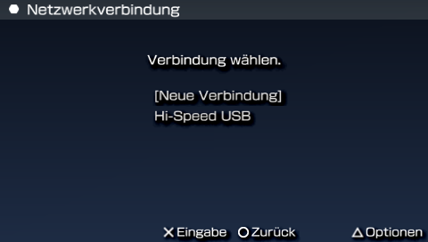
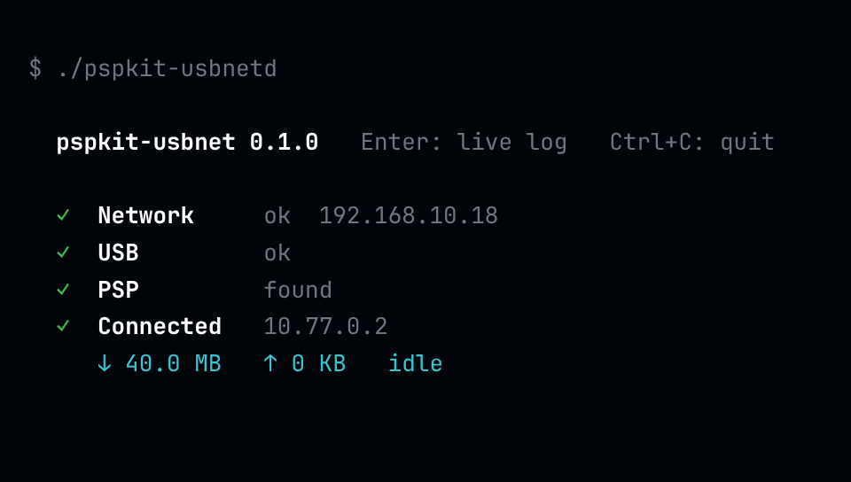

# pspkit-usbnet

**Bring your PSP online over the USB cable** — up to 10x faster than Wi-Fi & works on the PSP Street!

- 🧩 **One plugin**, no flashing needed, works in **all apps & games**
- ⚡ **Ten times faster** than Wi-Fi (4.8 vs 0.47 MB/s)
- 💻 **Gateway** for Linux, macOS and Windows: **one file**, nothing to install
- 🛠️ For developers: runs **beside PSPLink** on the same cable
- ✅ Works on the **PSP Street** (E1000)

| PSP | Gateway for Linux, macOS and Windows |
|---|---|
|  |  |

## 🚀 Get started

**1. PSP:** put [`usbnet.prx`](https://github.com/chriopter/pspkit-usbnet/releases/latest/download/usbnet.prx) into `ms0:/seplugins/` and enable it

**2. PC:** run the gateway

Linux
```sh
curl -Lo pspkit-usbnetd https://github.com/chriopter/pspkit-usbnet/releases/latest/download/pspkit-usbnetd-linux-x86_64 && chmod +x pspkit-usbnetd && ./pspkit-usbnetd
```

macOS
```sh
curl -Lo pspkit-usbnetd https://github.com/chriopter/pspkit-usbnet/releases/latest/download/pspkit-usbnetd-macos && chmod +x pspkit-usbnetd && ./pspkit-usbnetd
```

Windows
```sh
curl.exe -Lo pspkit-usbnetd.exe https://github.com/chriopter/pspkit-usbnet/releases/latest/download/pspkit-usbnetd-windows-x86_64.exe && pspkit-usbnetd.exe
```

**3. PSP, once:** create the connection

Network Settings → Infrastructure Mode → New Connection → Scan → "Hi-Speed USB" → Security: None → save

**4. PSP:** connect with "Hi-Speed USB", like with Wi-Fi

## ⚙️ How it works

The PSP believes it is on Wi-Fi. `usbnet.prx` sits where the WLAN driver would and sends every network packet through the USB cable; the gateway on the PC is its router. **PSPLink keeps a lane of its own in the same cable**, so you can debug and be online at once.

```
        PSP                                        PC
 ┌───────────────────┐                   ┌────────────────────────────┐
 │  game / app       │                   │                            │
 │      │ sockets    │                   │                            │
 │  Sony's network   │                   │                            │
 │      │            │   one USB cable   │                            │
 │  usbnet.prx ══════╪═══ network ═══════╪══► pspkit-usbnetd ══► 🌐   │
 │  usbhostfs  ──────╪─── PSPLink ───────╪──► pspsh, host0:           │
 └───────────────────┘                   └────────────────────────────┘
```

<table>
<tr><th></th><th>Wi-Fi</th><th>USB</th><th>PSPLink</th></tr>
<tr><td><b>App</b></td><td colspan="2" align="center">sockets</td><td></td></tr>
<tr><td><b>System</b></td><td colspan="2" align="center">Sony's stack, unchanged</td><td></td></tr>
<tr><td><b>Driver</b></td><td align="center">WLAN</td><td align="center"><code>usbnet.prx</code></td><td align="center">usbhostfs</td></tr>
<tr><td><b>Link</b></td><td align="center">radio</td><td colspan="2" align="center">one USB cable</td></tr>
<tr><td><b>PC</b></td><td align="center">router</td><td align="center"><code>pspkit-usbnetd</code></td><td align="center"><code>pspsh</code></td></tr>
</table>

## Details

<details>
<summary><b>Notes</b></summary>

- Linux: run with `sudo`, or add a udev rule for `054c:01c9`
- Windows: install the WinUSB driver once ([Zadig](https://zadig.akeo.ie))
- The PC is a gateway with NAT, like a home router
- DNS is the PC's; `--dns IP` picks another server, or set one in the connection on the PSP
- The connection is an ordinary saved one: edit or delete it like any other
- USB is only taken while connected
- Hold START at power-on to start without plugins
- ARK plugin line: `always, ms0:/seplugins/usbnet.prx, on`
- In the [PSPDX catalog](https://chriopter.github.io/pspdx-catalog/) as a plugin: `usbnet-psp.zip`
- With PSPLink: `pspsh -e "ldstart host0:/usbnet.prx"`
- Options: `alone`, `beside`, `nowlan`

</details>

<details>
<summary><b>Tested</b></summary>

- PSP-1000, 6.60 + ARK, Linux gateway
- From the XMB: connection made from the scan, connection test, a DNS server set by hand
- SOCOM: Fireteam Bravo 2 online (PSRewired): a round played
- PSPDX: catalog and installs
- Beside PSPLink: 80 of 80 downloads intact, 210 of 210 connects
- Untested: a real PSP Street, Windows, macOS

</details>

<details>
<summary><b>Development</b></summary>

```
make -C psp
cargo build --release --manifest-path gateway/Cargo.toml
./release.sh
```

| | |
|---|---|
| `psp/` | the plugin |
| `gateway/` | the gateway, `pspkit-usbnetd` |
| `tests/` | test program and soak scripts |

</details>

<details>
<summary><b>Credits</b></summary>

- [PSPLink](https://github.com/pspdev/psplinkusb): model for the USB code, BSD ([licence](THIRD_PARTY_PSPLINK_LICENSE))
- [libusb](https://libusb.info): inside the gateway, LGPL 2.1 ([licence](THIRD_PARTY_LIBUSB_LICENSE))
- [JPCSP](https://github.com/jpcsp/jpcsp): first map of the WLAN interface
- pspkit-usbnet is MIT

</details>
