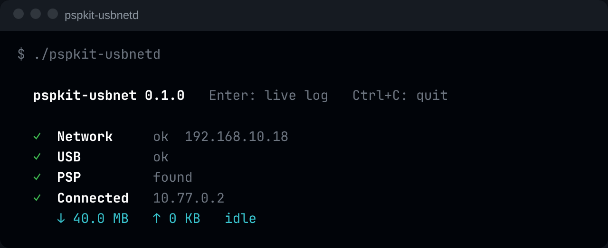

# pspkit-usbnet

**Bring your PSP online over the USB cable** — fast, and without Wi-Fi.

- 🧩 One plugin, no flashing needed, works in all apps & games
- ⚡ Ten times faster than Wi-Fi (4.8 vs 0.47 MB/s)
- 💻 PC app for Linux, Windows and macOS: one file, nothing to install
- 🛠️ For developers: runs beside PSPLink on the same cable
- ✅ Works on the PSP Street (E1000)

 

## 🚀 Install

Get both files from the [releases](https://github.com/chriopter/pspkit-usbnet/releases):

1. **PSP:** enable `usbnet.prx` as a plugin
2. **PC:** run `pspkit-usbnetd`
3. Connect with "Hi-Speed USB"

## ⚙️ How it works

<table>
<tr><th></th><th>Wi-Fi</th><th>USB</th><th>PSPLink</th></tr>
<tr><td><b>App</b></td><td colspan="2" align="center">sockets</td><td></td></tr>
<tr><td><b>System</b></td><td colspan="2" align="center">Sony's stack, unchanged</td><td></td></tr>
<tr><td><b>Driver</b></td><td align="center">WLAN</td><td align="center"><code>usbnet.prx</code></td><td align="center">usbhostfs</td></tr>
<tr><td><b>Link</b></td><td align="center">radio</td><td colspan="2" align="center">one USB cable</td></tr>
<tr><td><b>PC</b></td><td align="center">router</td><td align="center"><code>pspkit-usbnetd</code></td><td align="center"><code>pspsh</code></td></tr>
</table>

## Details

<details>
<summary><b>Notes</b></summary>

- Linux: run with `sudo`, or add a udev rule for `054c:01c9`
- Windows: install the WinUSB driver once ([Zadig](https://zadig.akeo.ie))
- The PC is a gateway with NAT, like a home router
- DNS is the PC's; `--dns IP` picks another server
- Nothing is saved on the PSP
- USB is only taken while connected
- Hold START at power-on to start without plugins
- ARK plugin line: `always, ms0:/seplugins/usbnet.prx, on`
- With PSPLink: `pspsh -e "ldstart host0:/usbnet.prx"`
- Options: `alone`, `beside`, `nowlan`

</details>

<details>
<summary><b>Tested</b></summary>

- PSP-1000, 6.60 + ARK
- 80 of 80 downloads intact, 210 of 210 connects
- PSPDX from the XMB: catalog and install
- Untested: a real PSP Street, games, Windows, macOS

</details>

<details>
<summary><b>Development</b></summary>

```
make -C psp
cargo build --release --manifest-path gateway/Cargo.toml
./release.sh
```

| | |
|---|---|
| `psp/` | the plugin |
| `gateway/` | the PC app |
| `tests/` | test program and soak scripts |

</details>

<details>
<summary><b>Credits</b></summary>

- [PSPLink](https://github.com/pspdev/psplinkusb): model for the USB code, BSD ([licence](THIRD_PARTY_PSPLINK_LICENSE))
- [libusb](https://libusb.info): inside the PC app, LGPL 2.1 ([licence](THIRD_PARTY_LIBUSB_LICENSE))
- [JPCSP](https://github.com/jpcsp/jpcsp): first map of the WLAN interface
- pspkit-usbnet is MIT

</details>
